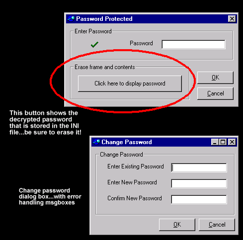



## a Password application ADD\-ON \- with option to change encrypted password in an ini file

### Description

I looked here and couldnt find what i was looking for, so i made it and am making it availible to everyone!

allows simple encryption to an external *.ini file (you choose location) as well, there is another dialog box that allows the user to change the password to whatever. READ THE READ_ME_.txt before running the password.exe. the password.exe is just to give you a quick view of the program. You have to go into the code and change a few of the settings.

----

all the code is commented for easy customization, and i hope you enjoy it! 

----

>If you like the "app add-on" then please vote for me <

----

 
### More Info
 
pretty neat prompt for password. After opening and initial running the application select the display password button to show whats in the ini file. After that erase the button and code.

encrypted password in an external file

             |
---                |---
**Submitted On**   |2000-11-20 10:25:28
**By**             |[paul\_cormie](https://github.com/Planet-Source-Code/PSCIndex/blob/master/ByAuthor/paul-cormie.md)
**Level**          |Intermediate
**User Rating**    |4.7 (56 globes from 12 users)
**Compatibility**  |VB 4\.0 \(32\-bit\), VB 5\.0, VB 6\.0
**Category**       |[Encryption](https://github.com/Planet-Source-Code/PSCIndex/blob/master/ByCategory/encryption__1-48.md)
**World**          |[Visual Basic](https://github.com/Planet-Source-Code/PSCIndex/blob/master/ByWorld/visual-basic.md)
**Archive File**   |[CODE\_UPLOAD1186911202000\.zip](https://github.com/Planet-Source-Code/paul-cormie-a-password-application-add-on-with-option-to-change-encrypted-password-in-an-i__1-12608/archive/master.zip)

